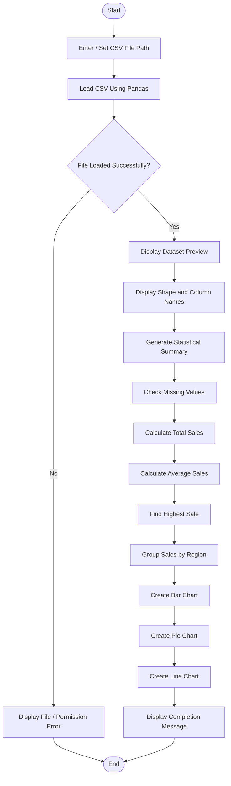
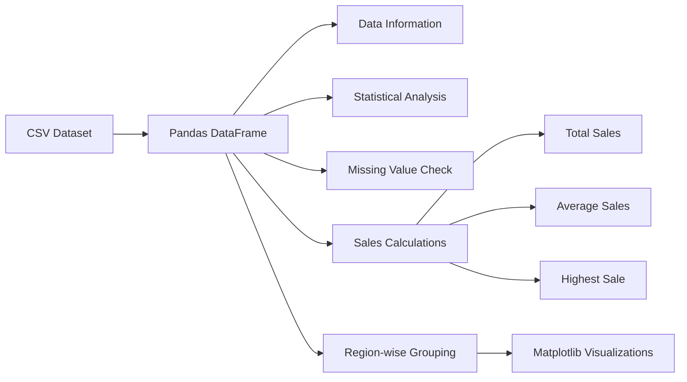

# 📊 Sales Data Analyzer & Data Visualization

A professional Python project that performs **sales data analysis** and creates meaningful **data visualizations** using **Pandas** and **Matplotlib**.

## 🚀 Project Overview

The Sales Data Analyzer loads a CSV sales dataset, analyzes important business metrics, checks data quality, and visualizes region-wise sales and sales trends.

### Main Features

- 📂 Load sales data from a CSV file
- 🔎 Display dataset preview and dimensions
- ℹ️ View dataset information and column names
- 📈 Generate statistical summaries
- 🧹 Check missing values
- 💰 Calculate total sales
- 📊 Calculate average sales
- 🏆 Identify the highest sale record
- 🌍 Calculate region-wise sales
- 📊 Create a bar chart for region-wise sales
- 🥧 Create a pie chart for sales distribution
- 📉 Create a line chart for sales trends
- ⚠️ Handle file and permission errors

---

## 🛠️ Technologies Used

| Technology | Purpose |
|---|---|
| Python | Core programming language |
| Pandas | Data loading and analysis |
| Matplotlib | Data visualization |
| OS Module | File name handling |

---

## 📁 Project Structure

```text
Pandas Analyzer & Data Visualization/
│
├── pandas_analyzer.py
├── sales_data.csv
└── README.md
```

---

## 🔄 Project Flowchart



---

## 📊 Data Analysis Workflow



---

## 📌 Required CSV Columns

The program expects the following columns:

| Column | Description |
|---|---|
| `Region` | Sales region name |
| `Sales` | Sales amount |

> Additional columns can also exist in the dataset.

---

## ⚙️ Installation

### 1. Install Python

Make sure Python is installed on your computer.

### 2. Install Required Libraries

```bash
pip install pandas matplotlib
```

---

## ▶️ How to Run the Project

### Step 1: Download or clone the project

Place the Python file and `sales_data.csv` in your project folder.

### Step 2: Update the CSV file path

Open `pandas_analyzer.py` and update:

```python
file_path = r"C:\Users\Armin Khareghat\OneDrive\Desktop\AI ML data science\Python\python-projects\Pandas Analyzer & Data Visualization\sales_data.csv"
```

Example:

```python
file_path = r"C:\Users\Armin Khareghat\OneDrive\Desktop\AI ML data science\Python\python-projects\Pandas Analyzer & Data Visualization\sales_data.csv"
```

### Step 3: Run the program

```bash
python pandas_analyzer.py
```

---

## 📈 Analysis Performed

### 1. Dataset Information

The program displays:

- Total rows
- Total columns
- Dataset preview
- Dataset shape
- Column names
- Data types and non-null values

### 2. Statistical Analysis

The program uses:

```python
df.describe()
```

This provides useful statistics for numeric columns such as count, mean, standard deviation, minimum, and maximum.

### 3. Missing Value Analysis

```python
df.isnull().sum()
```

This checks for missing values in every column.

### 4. Total Sales

```python
total_sales = df["Sales"].sum()
```

### 5. Average Sales

```python
average_sales = df["Sales"].mean()
```

### 6. Highest Sale

```python
highest_sale = df.loc[df["Sales"].idxmax()]
```

### 7. Region-wise Sales

```python
region_sales = df.groupby("Region")["Sales"].sum()
```

---

## 📊 Visualizations

### 📊 Bar Chart

Displays total sales for each region.

### 🥧 Pie Chart

Shows the percentage distribution of sales across regions.

### 📉 Line Chart

Displays the sales trend across dataset order numbers.

---

## ⚠️ Error Handling

The project handles common file-related errors:

- `FileNotFoundError`
- `PermissionError`
- General exceptions

This helps the program display understandable messages instead of stopping unexpectedly.

---

## 🧠 Key Learning Outcomes

Through this project, you can learn:

- CSV file handling
- Pandas DataFrame operations
- Data inspection
- Statistical analysis
- Missing value detection
- GroupBy operations
- Data visualization with Matplotlib
- Python exception handling

---

## 🔮 Future Improvements

Possible future enhancements include:

- Add interactive file selection
- Add category-wise and product-wise analysis
- Add date-based sales trends
- Export analysis results to Excel
- Create an interactive dashboard
- Add more charts such as histogram and boxplot
- Build a GUI using Tkinter or Streamlit

---

## 👨‍💻 Author

**Armin Khareghat**  
B.Sc. Computer Science  
🤖 AI / ML & Data Science  

---

## 📜 License

This project is created for **educational and learning purposes**.

---

⭐ If you found this project useful, consider giving the repository a star!
